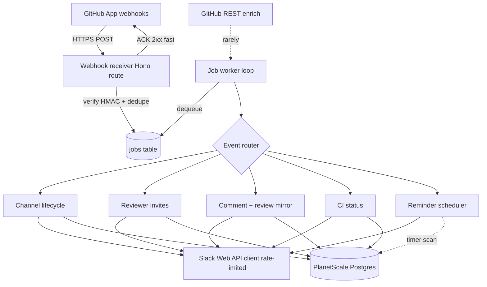
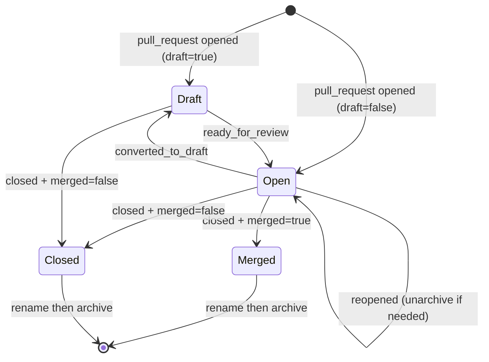
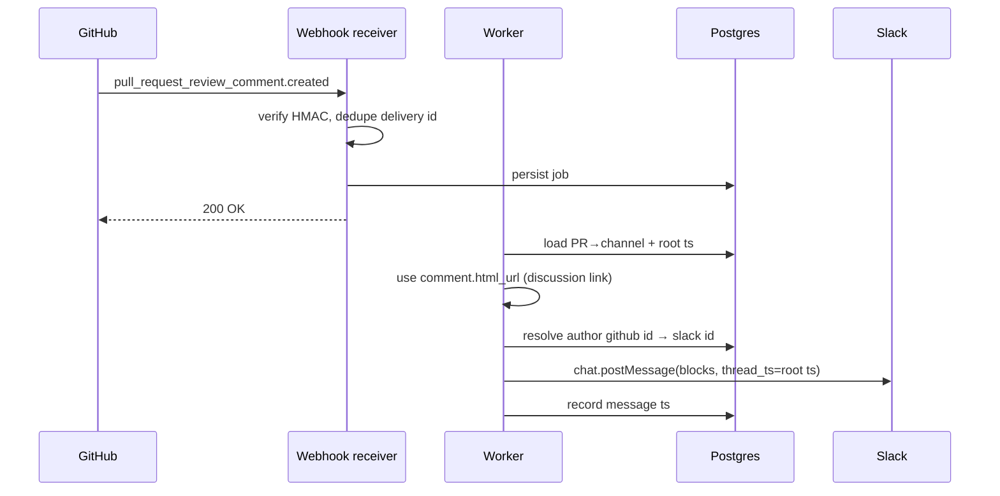

# GitHub → Slack PR Bot - Plan

## Goal Capsule

- **Objective:** Build an axolo.co-style bot that mirrors GitHub pull request activity into Slack, one channel per PR, with strictly one-way sync (GitHub → Slack).
- **Authority hierarchy:** This plan and its Product Contract govern behavior. Repo conventions and explicit user preferences override plan defaults. Slack/GitHub API constraints override desired behavior where they conflict (documented as Risks).
- **Execution profile:** Persistent TypeScript/Hono service on Unkey Deploy; PlanetScale Postgres; GitHub App webhooks in, Slack Web API out; in-process reminder scheduler. No Slack → GitHub write path anywhere.
- **Stop conditions:** All Implementation Units land, Verification Contract passes, and a live PR produces a channel that tracks state, mirrors review comments with working file/line deep links, invites reviewers, reports CI, and fires a 12h reminder.
- **Tail ownership:** The implementing agent owns branch/PR/CI; this plan owns scope and sequencing.

---

## Product Contract

### Summary

A persistent service that receives GitHub App webhooks and drives a Slack workspace so that each pull request gets a dedicated channel. The channel's name tracks PR state (draft, open, closed, merged), auto-archives on close/merge, invites requested reviewers, mirrors review comments with an "Open" deep link to the comment in the PR discussion (file:line shown as text), reports CI/CD results, and reminds when a requested review has sat unreviewed for ~12 hours. Communication is one-way: GitHub is the source of truth and nothing typed in Slack is written back to GitHub.

### Problem Frame

Code review discussion is scattered across GitHub's UI and misses the team where they already work — Slack. Notifications from GitHub's native Slack app are noisy, un-threaded, and don't give reviewers a focused space per PR. The team likes axolo.co's model: a channel per PR concentrates the review conversation, keeps state visible in the channel name, pulls the right reviewers in, and links each review comment straight back to the source line. Unkey already runs its own server infrastructure (Unkey Deploy) and Postgres (PlanetScale), so a self-hosted bot is cheaper and more controllable than a SaaS subscription.

The build-vs-buy question is already settled: the team trialed axolo in production, likes the model, and is deliberately choosing to build in-house — for control over where private-repo data lives (self-hosted) and to avoid per-seat SaaS cost at the team's scale. Because sync is one-way, the GitHub PR remains the system of record; the Slack channel is a notification and awareness surface, not the authoritative venue for decisions — anything that must persist belongs on the PR (see R-risk-6).

### Requirements

**Channel lifecycle**
- R1. Each pull request maps to exactly one Slack channel, created when the PR is opened (including draft) and recorded as a durable PR ↔ channel mapping.
- R2. The channel name reflects PR state across `draft`, `pr` (open/ready), `closed`, and `merged`.
- R3. The channel is auto-archived when the PR is closed or merged, after the final state rename.

**Activity mirroring**
- R4. Inline review comments are mirrored into the PR's channel with the file path and line number shown as text, and an "Open" link that jumps to the comment in the PR discussion (`comment.html_url`, e.g. `…/pull/7006#discussion_r…`).
- R5. Review submissions (approved / changes requested / commented) are mirrored into the channel.
- R6. The PR's overall mergeability (ready to merge / blocked / conflicts / behind base / checks failing) is reported in the channel, refreshed when CI completes or a review is submitted, and posted only when the state changes. This replaces per-check CI messages: `mergeable_state` folds required checks, branch protection, and merge conflicts into one signal.
- R7. PR lifecycle activity (opened, ready-for-review, converted-to-draft, closed, merged, reopened) and all mirrored activity are reported as top-level messages directly in the channel — not as thread replies. The channel itself is the per-PR conversation, so every update is a normal channel message.
- R12. When a PR is **merged** (only merged, never a plain close), a clean announcement — `<repo>#<number> <title> has shipped` — is posted to a configured shared `#shipped` channel (`SLACK_SHIPPED_CHANNEL`, a channel id or name; unset disables it). Idempotent per PR.

**Reviewers**
- R8. The PR author is invited to the channel when it is created, and each requested reviewer is invited when the review is requested. Invites resolve the GitHub user to a linked Slack account (identity map, U9) and are idempotent; an unlinked user is skipped and retried on later events.

**Reminders**
- R9. A reminder posts approximately 12 hours after a review is requested if that review is still pending; it is suppressed once the review is submitted, the review request is removed, or the PR is closed/merged.

**Sync boundary & identity**
- R10. Sync is one-way GitHub → Slack by default: the service never writes to GitHub, with a **single opt-in exception** (R13, default off). The GitHub PR stays the system of record; Slack is a notification/awareness surface, so review decisions that must persist are made on the PR.
- R13. Opt-in (`GITHUB_COMMENT_ON_MERGE`, default off): when a PR merges, post one comment on the PR containing the Slack channel URL for context. This is the only GitHub write; enabling it requires granting the GitHub App write permission (Pull requests / Issues) and reinstalling. The bot ignores comments it authored (echo guard), and the write posts at most once per PR.
- R11. GitHub users are mapped to Slack users through a stored mapping keyed on the immutable GitHub numeric user id. The mapping is populated by a first-release OAuth-verified `/link-github` command and admin bulk-import (U9), with Slack email lookup as an auto-match fallback.

### Actors

- A1. **PR author** — opens/updates PRs; watches their channel for review activity and CI.
- A2. **Reviewer** — requested on a PR; invited to the channel; subject of the 12h reminder.
- A3. **The bot** — the GitHub App identity receiving webhooks and the Slack bot posting/managing channels.
- A4. **Workspace admin** — installs the GitHub App and Slack app, and owns channel-count cleanup (see Risks).

### Scope Boundaries

**In scope:** single Slack workspace + single GitHub App installation; public PR channels; a first-release identity-population path (`/link-github` self-link + admin bulk-import, U9); the features in R1–R11.

#### Deferred to Follow-Up Work
- Slack Events API subscription for `channel_archive` / `channel_rename` to re-sync the mapping when a human manually edits a PR channel (start push-only; add if desync becomes a real problem).
- Private PR channels (`groups:*` scopes) — plan for public channels first.
- Channel reuse / bulk-archive tooling to manage workspace channel-count growth (see Risks R-risk-1).
- Legacy Commit Status API (`status` event) support — add only if a target repo reports CI via commit statuses rather than the Checks API.
- `check_suite`-level CI aggregation — add only if per-`check_run` posting proves noisy on large matrices.
- Multi-workspace / multi-installation tenancy.

#### Outside this product's identity
- Any Slack → GitHub write-back (approvals, comments, merges from Slack). This is a permanent non-goal per R10, not a deferral.
- Analytics dashboards, review-time metrics, or reporting surfaces.

---

## Planning Contract

### Key Technical Decisions

- KTD1. **Persistent TS/Hono service on Unkey Deploy, not Cloudflare Workers.** A long-running process can host the reminder scheduler in-process and hold an async job queue, removing the need for Workers Cron/Durable Objects. Matches Unkey's existing deploy story.
- KTD2. **PlanetScale Postgres via Drizzle ORM** for all state: installations, PR↔channel mapping, message roots, identity map, reminder queue, and webhook dedupe. Cheap, already provisioned, and Drizzle matches Unkey's conventions.
- KTD3. **ACK-fast, process-async.** The webhook endpoint verifies the signature, dedupes, persists the raw event to a jobs table, and returns 2xx within GitHub's ~10s window. A worker loop processes jobs so slow Slack enrichment never triggers GitHub retries (which would duplicate Slack posts).
- KTD4. **Idempotent, state-derived Slack updates.** GitHub delivery is at-least-once and unordered. Channel state is a pure function of the latest known PR state (stored), not of event arrival order; message posting dedupes on `(delivery_id)` and on natural keys (e.g. one CI message per check run + conclusion).
- KTD5. **The review-comment "Open" link is the comment's discussion URL** (`comment.html_url`, e.g. `…/pull/7006#discussion_r…`), landing the reader in the PR conversation thread rather than the file/line blob view. The `comment.path`:`comment.line` still renders as text context alongside the link.
- KTD6. **Identity map keyed on GitHub numeric `id`, never `login`.** Logins are mutable; the numeric id is stable. The map is populated primarily by the GitHub OAuth-verified `/link-github` self-link command and admin bulk-import (U9); `users.lookupByEmail` is a best-effort auto-match fallback that is cached and expected to miss (GitHub profile/commit email ≠ Slack email frequently), and the email itself is only available via a read-only `GET /users/{login}` public-profile lookup.
- KTD7. **Channel naming = sanitized, state-prefixed, title-tailed, stored by id.** Pattern `<state>-<repo-slug>-<number>-<title-slug>` (e.g. `pr-unkey-api-6949-configure-amp-orb-setup-and-service-portals`), lowercased and slugified to satisfy Slack's ≤80-char, lowercase, `[a-z0-9-_]` rule (the title is trimmed to fit). `<state>-<repo>-<number>` uniquely identifies a PR; the title is the readable tail. The channel is always addressed by stored `channel_id`, never by re-deriving the name.
- KTD8. **Rename-before-archive ordering.** Slack cannot rename an archived channel, so the close/merge handler renames to the terminal state first, then archives.
- KTD9. **Client-side rate limiting.** `conversations.create` is Tier 2 (~20/min) — the tightest limit and a real risk during PR floods — so channel creation runs through a throttled queue. All Slack calls honor HTTP 429 `Retry-After`; `chat.postMessage` is paced to ~1/sec per channel.
- KTD10. **Single active writer for jobs and reminders.** The job worker and reminder timer run in-process, so concurrency must be bounded: either pin the service to a single instance on Unkey Deploy, or claim work atomically (`SELECT … FOR UPDATE SKIP LOCKED` for jobs; a conditional `UPDATE … WHERE status='pending'` compare-and-swap for reminders). Reminder posting is check-then-act with no `delivery_id`, so without an atomic claim two instances (or a rolling-deploy overlap) would double-post. The chosen approach is recorded here and enforced by a two-process test in U8.
- KTD11. **Untrusted GitHub text is neutralized before Slack rendering.** Review-comment and review bodies are attacker-controllable (any commenter, including outside collaborators on public repos), so before they enter a Slack `mrkdwn` block the service escapes `&`/`<`/`>` and strips Slack control sequences (`<!channel>`, `<!here>`, `<!everyone>`, `<!subteam^…>`) — or renders the body as `plain_text`. Prevents mass-ping and link-injection abuse.
- KTD12. **Secrets from the Unkey Deploy secret store, never logged.** The GitHub App private key, webhook and OAuth client secrets, OAuth state signing secret, Slack bot token, and Slack signing secret load from the platform secret store — never committed, never written to logs — with a documented rotation procedure. `.env.example` documents names only.
- KTD13. **Raw-payload retention and minimization.** `jobs.raw` holds private-repo data (diff hunks, author emails, branch names), so the store persists only the fields downstream handlers need and purges raw payloads after successful processing (or a short TTL). Bounds how long someone else's source lives outside GitHub.

### High-Level Technical Design

**Component topology**

**PR → channel state machine** (drives R2, R3, KTD7, KTD8)

**Review-comment mirroring sequence** (drives R4, the marquee feature)

### Assumptions

- The bot operates on one Slack workspace and one GitHub App installation for the first release (multi-tenant deferred).
- PR channels are public; private-channel support is deferred.
- GitHub Actions (Checks API) is the CI source. Legacy Commit Status API support and `check_suite` aggregation are deferred (Scope Boundaries), so U7 builds the `check_run` path only.
- "12 hours" measures from the `review_requested` event, per-reviewer, and is cancelled by any submitted review from that reviewer, a removed review request, or PR close/merge — confirmed with the user.
- Slack and GitHub app registration/credentials are provisioned by an admin out of band; the plan consumes them from the Unkey Deploy secret store (KTD12).
- The service runs as a single active writer (KTD10) — either one instance, or multiple with atomic work claiming; the concurrency model is chosen at implementation and tested in U8.

### Sequencing

U1 → U2 are the foundation. U3 depends on U1/U2. U4 depends on U3. U5, U6, U7 each depend on U3/U4 and can be built in parallel once the router exists. U8 depends on U3/U4 and U5 (its scheduling trigger comes from U5's `review_requested` handling), so it follows U5. U9 (identity population) depends on U1/U2 and can run in parallel with U3–U8; U5's resolution path improves as U9 fills the map.

---

## Implementation Units

### U1. Service scaffold, config, and deploy skeleton

- **Goal:** Stand up the TypeScript/Hono service with typed config, structured logging, a health endpoint, and Unkey Deploy configuration.
- **Requirements:** Foundation for all.
- **Dependencies:** none.
- **Files:** `src/index.ts`, `src/server.ts`, `src/config.ts`, `src/logger.ts`, `src/routes/health.ts`, `package.json`, `tsconfig.json`, `biome.json`, `unkey.deploy.json` (or repo-standard deploy manifest), `.env.example`, `README.md`, `src/config.test.ts`.
- **Approach:** Hono app with a health route and a config module that validates required env at boot (GitHub App id + private key + webhook secret, Slack bot token, `DATABASE_URL`, workspace/installation ids) and fails fast on missing values. Establish the repo's toolchain (Vitest, Biome, TypeScript) so later units have test/lint/typecheck commands.
- **Execution note:** Mostly scaffolding/config — prefer a boot smoke test plus config-validation unit tests over broad coverage.
- **Test scenarios:**
  - Config loads and validates when all required env vars are present.
  - Missing required env var fails fast with a clear error naming the variable.
  - Health endpoint returns 200 with service status.
  - `Test expectation:` config validation and health boot only; no domain behavior yet.
- **Verification:** Service boots locally, `/health` returns 200, typecheck + lint + test commands run green.

### U2. Database schema and data layer

- **Goal:** Define the Postgres schema and Drizzle data-access layer for all persistent state.
- **Requirements:** R1, R9, R11 (storage substrate); supports R2–R8.
- **Dependencies:** U1.
- **Files:** `src/db/client.ts`, `src/db/schema.ts`, `src/db/migrations/` (generated), `src/db/repositories/pullRequests.ts`, `src/db/repositories/messages.ts`, `src/db/repositories/identities.ts`, `src/db/repositories/reminders.ts`, `src/db/repositories/jobs.ts`, `src/db/repositories/deliveries.ts`, `drizzle.config.ts`, `src/db/schema.test.ts`.
- **Approach:** Tables — `installations`; `pull_requests` (repo, number, github pr id, channel_id, current_state, `head_sha`, root_message_ts, unique on repo+number); `messages` (pr id, github event ref, slack ts, kind); `identities` (github_user_id PK, github_login, slack_user_id, source); `reminders` (pr id, reviewer github id, due_at, status: pending/sent/cancelled); `jobs` (delivery_id, event, action, raw payload, status, attempts, claimed_at); `processed_deliveries` (delivery_id PK, seen_at) for dedupe. `head_sha` is the join key CI reporting uses to map a check to its PR (KTD-driven, U7); it is refreshed on `opened`/`synchronize`. Repositories expose typed upserts, atomic work-claiming for jobs/reminders (KTD10), and idempotent state transitions (KTD4). Raw payloads are retained per KTD13 — store only needed fields and purge `jobs.raw` after successful processing (or a short TTL).
- **Test scenarios:**
  - PR upsert is idempotent on (repo, number) — second upsert updates, does not duplicate.
  - `head_sha` is updated on a `synchronize` upsert; lookup by `head_sha` returns the current PR.
  - Recording a processed delivery id twice is a no-op (dedupe key holds).
  - Reminder rows transition pending → sent and pending → cancelled but not sent → pending.
  - An atomic reminder claim (`UPDATE … WHERE status='pending'`) returns the row to exactly one caller under concurrent claims.
  - Identity lookup by GitHub numeric id returns the mapped Slack id; unknown id returns null.
  - `jobs.raw` is purged/nulled after a job reaches terminal success (retention, KTD13).
- **Verification:** Migrations apply cleanly to a PlanetScale Postgres branch; repository tests pass against a test database.

### U3. Webhook ingestion, verification, dedupe, and GitHub auth

- **Goal:** Receive GitHub webhooks securely, dedupe, ACK fast, enqueue work, and provide cached installation-token auth for enrichment.
- **Requirements:** R10 (receive-only), enabling R1–R9.
- **Dependencies:** U1, U2.
- **Files:** `src/routes/githubWebhook.ts`, `src/github/verify.ts`, `src/github/auth.ts`, `src/github/client.ts`, `src/worker/queue.ts`, `src/routes/githubWebhook.test.ts`, `src/github/verify.test.ts`, `src/github/auth.test.ts`.
- **Approach:** Read the **raw** request body before any JSON parsing; verify `X-Hub-Signature-256` via HMAC-SHA256 with `crypto.timingSafeEqual` (KTD3). After signature verification, authorize: assert the payload's `installation.id` (and optionally repo owner) matches the configured allowlist; reject and log otherwise (signature proves authenticity, the allowlist proves it is the expected installation). Dedupe on `X-GitHub-Delivery`; if new, persist a job row and return 2xx immediately. Secrets (private key, webhook secret) load from the Unkey Deploy secret store and are never logged (KTD12). Auth module mints an RS256 app JWT (≤10-min exp), exchanges it for a per-installation token (1h), caches per installation, and refreshes on expiry/401 (use `@octokit/auth-app`). The enrichment client is used sparingly since payloads already carry most data.
- **Execution note:** Start with a failing test that posts a signed body and asserts a job row is written; verification correctness is security-critical.
- **Test scenarios:**
  - Valid signature over the raw body is accepted; a tampered body is rejected with 401 and no job written.
  - Missing/legacy-only (`X-Hub-Signature` SHA-1) signature is rejected.
  - A valid-signature event whose `installation.id` is not on the allowlist is rejected and logged, no job written.
  - Duplicate `X-GitHub-Delivery` is ACKed but does not create a second job (dedupe).
  - Endpoint returns 2xx well within the timeout without waiting on Slack.
  - Installation token is cached and reused; a simulated 401/expiry triggers a re-mint.
- **Verification:** A signed sample payload from the allowlisted installation creates exactly one job; a replayed delivery creates none; an off-allowlist installation is rejected; token minting works against a test app.

### U4. Event router and PR lifecycle → channel management

- **Goal:** Consume jobs, route by event, and drive channel create/rename/archive from PR state.
- **Requirements:** R1, R2, R3, R7.
- **Dependencies:** U3.
- **Files:** `src/worker/router.ts`, `src/worker/loop.ts`, `src/handlers/pullRequest.ts`, `src/slack/client.ts`, `src/slack/channels.ts`, `src/slack/rateLimiter.ts`, `src/slack/naming.ts`, `src/handlers/pullRequest.test.ts`, `src/slack/naming.test.ts`, `src/slack/rateLimiter.test.ts`.
- **Approach:** A worker loop dequeues jobs and dispatches by `X-GitHub-Event` + `action`. The PR handler computes the target state from the payload (merged = `closed` + `merged===true`, KTD; draft from `pull_request.draft`), then reconciles: create channel if none stored (throttled Tier-2 queue, KTD9), else rename to the state-prefixed name; on close/merged rename to terminal state **then** archive (KTD8); on reopened, unarchive if archived. Post a PR-activity message and store its `ts` as the channel root for threading (R7). Slack client centralizes 429 `Retry-After` backoff and per-channel pacing.
- **Test scenarios:**
  - `pull_request.opened` with draft=true creates a `draft-<repo>-<n>` channel and stores the mapping and root ts.
  - `ready_for_review` renames `draft-…` → `pr-…`; `converted_to_draft` renames back.
  - `closed` with merged=true renames to `merged-…` then archives (rename precedes archive).
  - `closed` with merged=false renames to `closed-…` then archives.
  - `reopened` unarchives and renames to `pr-…`.
  - Re-delivered opened event does not create a second channel (idempotent on stored mapping).
  - Repo name with `/`, `.`, or uppercase is slugified and total name ≤80 chars, lowercase.
  - A 429 from `conversations.create` is retried after `Retry-After` without dropping the job.
- **Verification:** A simulated PR lifecycle produces one channel whose name tracks each transition and which archives exactly once after the terminal rename.

### U5. Reviewer invitation and identity mapping

- **Goal:** Invite requested reviewers into the PR channel, resolving GitHub → Slack identity.
- **Requirements:** R8, R11.
- **Dependencies:** U3, U4.
- **Files:** `src/handlers/reviewRequest.ts`, `src/identity/resolve.ts`, `src/slack/invite.ts`, `src/slack/users.ts`, `src/handlers/reviewRequest.test.ts`, `src/identity/resolve.test.ts`.
- **Approach:** On `pull_request.review_requested`, extract `requested_reviewer` (github id + login). Resolve via `identities` (keyed on numeric id, KTD6) — the map is seeded by U9. On miss, try the email fallback: fetch the reviewer's public email via a read-only `GET /users/{login}` lookup (a read, so it does not cross the one-way boundary), then `users.lookupByEmail` (scope `users:read.email`), and cache the result; a private/noreply email means the fallback can't resolve. On still-miss, post a message naming the GitHub login without a mention and record the gap. Invite resolved Slack ids via `conversations.invite` (Tier 3, dedupe already-in-channel). Handle `review_request_removed` gracefully (no-op or note).
- **Test scenarios:**
  - Reviewer already in identity map (via U9) is invited by stored Slack id.
  - Reviewer absent from map but with a public email is looked up (`GET /users/{login}` → `users.lookupByEmail`), cached, and invited.
  - Reviewer with a private/noreply email and no map entry: message posts with plain login, no crash, gap recorded.
  - Team-requested review (`requested_team`) is handled without attempting a user lookup.
  - Duplicate `review_requested` does not double-invite.
- **Verification:** Requesting a mapped reviewer adds them to the channel; an unmapped reviewer degrades gracefully to a plain-login message.

### U6. Review comment and submission mirroring with file/line deep links

- **Goal:** Mirror inline review comments and review submissions into the channel with a working "Open at line" link. (Marquee feature — the attached image.)
- **Requirements:** R4, R5, R7.
- **Dependencies:** U3, U4.
- **Files:** `src/handlers/reviewComment.ts`, `src/handlers/review.ts`, `src/slack/blocks.ts`, `src/handlers/reviewComment.test.ts`, `src/slack/blocks.test.ts`.
- **Approach:** On `pull_request_review_comment.created`, compose a Block Kit message: a `section` with the comment body and a `context` block with `<comment.html_url|Open> · \`path:line\` · by <@slackId>` (mirroring the image). The "Open" link is the comment's discussion URL (KTD5), so it lands in the PR conversation; `path:line` is text context. The comment body is untrusted GitHub text, so escape/sanitize it before it enters the `mrkdwn` block (KTD11) — strip Slack control sequences (`<!channel>`, `<!here>`, `<!subteam^…>`) and escape `&`/`<`/`>`, or render as `plain_text`. Post directly in the channel as a top-level message (not a thread reply). Always set a top-level `text` fallback. **Out-of-order handling (KTD4):** if the PR row / `root_message_ts` doesn't exist yet (a child event overtook the `opened` event), lazily reconcile the channel and root message from the child payload's embedded `pull_request` object before threading, or requeue the job until the root exists. On `pull_request_review.submitted`, post an approved/changes-requested/commented summary (same sanitization). `issue_comment` filtered to PRs via `issue.pull_request`.
- **Execution note:** Implement body sanitization test-first — mirroring untrusted comment text into Slack is security-critical.
- **Test scenarios:**
  - The "Open" link uses `comment.html_url` (the discussion URL), not a `/blob/` file link.
  - A comment with no line still renders (file shown, discussion link intact).
  - Path with spaces/special chars is URL-encoded correctly.
  - A comment body containing `<!channel>` / `<!here>` / crafted `<url|text>` cannot produce a broadcast or injected link (sanitized/escaped).
  - A `review_comment` job that arrives before the PR's `opened` event reconciles the channel + root from the child payload (or requeues), never posting to a null thread target.
  - Comment message posts directly in the channel, with author rendered as a Slack mention when mapped and plain login when not.
  - `pull_request_review.submitted` with state `changes_requested` posts a distinct summary from `approved`.
  - `issue_comment` on a non-PR issue is ignored.
  - Fallback `text` is present on every posted message.
- **Verification:** A real review comment appears as a channel message with an "Open" link that lands on the comment in the PR discussion, the file:line shown as text, and a body with Slack control sequences renders inert.

### U7. Mergeability status reporting

- **Goal:** Report the PR's mergeability into the channel (replaces per-check CI messages). `check_run` completion and `pull_request_review` submission are the triggers; each fetches the PR's `mergeable_state` (read-only `GET /pulls/{number}`), maps it to a friendly status, and posts only on change. GitHub computes mergeability asynchronously, so an `unknown`/null result retries with backoff until it settles.
- **Requirements:** R6.
- **Dependencies:** U3, U4.
- **Files:** `src/handlers/checks.ts`, `src/ci/status.ts`, `src/handlers/checks.test.ts`, `src/ci/status.test.ts`.
- **Approach:** Handle `check_run` only — report on `action: completed` with `conclusion`, linking `html_url`. (`check_suite` aggregation and legacy `status` support are deferred, Scope Boundaries.) Map the check to its PR by `head_sha`: primary join on the `pull_requests.head_sha` column (U2, kept fresh on `opened`/`synchronize`); fall back to a read-only `GET /commits/{sha}/pulls` lookup when no local match (e.g. fork-based checks) — a read, so it stays within the one-way boundary. Post to the channel (optionally threaded under the PR root).
- **Test scenarios:**
  - `check_run.completed` with `conclusion: failure` posts a failure message with the `html_url` link.
  - `check_run` still `in_progress` posts nothing.
  - Duplicate `check_run` completion for the same run id + conclusion is not double-posted.
  - A `head_sha` matching a stored `pull_requests.head_sha` routes to that PR's channel.
  - A `head_sha` with no local match falls back to `GET /commits/{sha}/pulls`; if that resolves no tracked PR, the check is ignored.
- **Verification:** A failing and a passing CI run each produce one clear channel message linking to the run, routed to the correct PR channel via `head_sha`.

### U8. Reminder scheduler

- **Goal:** Fire a ~12h reminder for a still-pending requested review, in-process and DB-backed.
- **Requirements:** R9.
- **Dependencies:** U3, U4, U5.
- **Files:** `src/scheduler/reminders.ts`, `src/scheduler/loop.ts`, `src/handlers/reviewRequest.ts` (schedule hook), `src/handlers/review.ts` (cancel hook), `src/scheduler/reminders.test.ts`.
- **Approach:** On `review_requested`, insert a `reminders` row `due_at = now + 12h`, status `pending`, keyed to (pr, reviewer github id). A timer loop in the long-running process scans for `pending` rows with `due_at <= now` and claims each with an atomic `UPDATE … SET status='sent' WHERE id=? AND status='pending'` (KTD10) — only the caller whose update affects a row proceeds to post, so concurrent scanners (multi-instance or rolling-deploy overlap) can't double-post. Before posting, re-check that the review is still outstanding and the PR is still open, then post a reminder into the channel mentioning the reviewer. Any `pull_request_review.submitted` from that reviewer, `review_request_removed`, or PR close/merge cancels matching `pending` rows (KTD4 idempotency). Scan interval and the 12h window are configurable.
- **Execution note:** Test with an injectable clock so the 12h boundary and cancellation are deterministic without waiting.
- **Test scenarios:**
  - Review requested schedules a pending reminder due ~12h out.
  - At/after due time with the review still pending, one reminder posts and the row flips to `sent`.
  - Review submitted before due time cancels the reminder — nothing posts.
  - PR merged/closed before due time cancels pending reminders.
  - `review_request_removed` cancels the matching pending reminder.
  - Two concurrent scan loops over the same due row post exactly one reminder (atomic claim, KTD10).
  - A reminder never fires twice for the same row (idempotent scan under re-entry).
- **Verification:** With a simulated clock, a pending review reminds exactly once at 12h, never reminds when the review arrived first, and never double-posts under two concurrent scanners.

### U9. Identity population (self-link command + admin import)

- **Goal:** Give the `identities` map a reliable day-one population path so reviewer invites and mentions work at launch, rather than depending on the miss-prone email fallback.
- **Requirements:** R8, R11.
- **Dependencies:** U1, U2.
- **Files:** `src/routes/slackCommand.ts`, `src/routes/githubOAuth.ts`, `src/github/oauth.ts`, `src/slack/verify.ts`, `src/identity/link.ts`, `src/routes/slackCommand.test.ts`, `src/routes/githubOAuth.test.ts`, `src/github/oauth.test.ts`, `src/slack/verify.test.ts`, `src/identity/import.test.ts`.
- **Approach:** Add a Slack slash command `/link-github` — a new inbound Slack surface. Verify Slack's request signature (`X-Slack-Signature` + timestamp, signing secret from the secret store, KTD12) and the configured Slack workspace, then immediately return an ephemeral GitHub App OAuth URL. Bind the Slack user and workspace to a short-lived HMAC-signed state. The callback exchanges the one-time code and reads authenticated `GET /user`; only that verified immutable numeric id may be linked. An existing GitHub id cannot be transferred to another Slack user through self-service linking. Provide an admin bulk-import path (`import.ts`) that seeds `identities` from a CSV/JSON of `github_login,slack_email` (or `slack_user_id`) pairs. This unit adds Slack and OAuth callback inbound URLs; it does not write to GitHub.
- **Execution note:** Verify the Slack signing-secret check test-first — it is an inbound public endpoint and security-critical (same posture as U3's webhook verification).
- **Test scenarios:**
  - `/link-github` returns an ephemeral authorization URL without awaiting DB or network I/O.
  - A successful OAuth callback maps the Slack id from signed state to the numeric id returned by authenticated `GET /user`.
  - Invalid/stale Slack signatures, wrong workspaces, and invalid/expired OAuth state are rejected before DB or GitHub calls.
  - Self-service linking cannot reassign a GitHub numeric id already owned by another Slack user.
  - Reauthenticating as the same mapping refreshes the login rather than duplicating the row.
  - Admin bulk-import seeds N rows from a CSV; malformed rows are reported and skipped, not fatal.
  - OAuth exchange and API failures return a generic response without persisting an identity or exposing a token.
- **Verification:** After a `/link-github` call, a subsequent `review_requested` for that reviewer (U5) resolves to a Slack mention and a real channel invite.

---

## Verification Contract

Commands are established in U1 (greenfield repo); use the repo-standard toolchain once set.

| Gate | Command (intended) | Applies to |
|---|---|---|
| Type check | `pnpm typecheck` | all units |
| Lint/format | `pnpm biome check` | all units |
| Unit + integration tests | `pnpm test` (Vitest) | all feature units (U2–U9) |
| DB migration check | `pnpm db:migrate` (drizzle-kit) against a PlanetScale test branch | U2 |
| Local end-to-end smoke | Replay signed sample webhook fixtures (opened → review_requested → review_comment → check_run → merged) against a test Slack workspace | U3–U9 |

- Each unit's enumerated Test Scenarios must pass.
- Security- and feature-critical gates that must pass before merge: GitHub webhook signature verification and installation allowlist (U3), Slack slash-command signature verification (U9), and comment-body sanitization (U6, KTD11).
- Slack calls in tests are mocked; the end-to-end smoke uses a scratch Slack workspace and a test GitHub App.

---

## Definition of Done

**Global**
- R1–R11 are satisfied and demonstrated by the end-to-end smoke path.
- One-way boundary (R10) holds by default: the only GitHub write is the opt-in merge comment (R13), gated behind `GITHUB_COMMENT_ON_MERGE` and off unless explicitly enabled. All other GitHub calls are reads (enrichment/identity/CI-mapping/mergeability).
- Rate-limit handling (429 `Retry-After`, Tier-2 create queue, per-channel pacing) is in place.
- Webhook dedupe and idempotent state updates hold under replayed/out-of-order deliveries, and the concurrency model (KTD10) prevents double-posting under two workers/schedulers.
- Secrets load from the secret store and never appear in logs (KTD12); untrusted GitHub text is sanitized before Slack rendering (KTD11); the webhook enforces the installation allowlist (U3).
- Type check, lint, and tests are green; abandoned/experimental code from the build is removed from the diff.
- `.env.example` and README document required config (including the Slack signing secret) and the GitHub App + Slack app setup.

**Per-unit**
- Each U#'s Verification line is met and its Test Scenarios pass.

---

## Risks & Dependencies

- R-risk-1. **Unbounded Slack channel growth.** Archived channels still count toward the workspace channel limit and cannot be deleted via API. One channel per PR accumulates forever. Mitigation: document the limit for admins (A4); deferred channel-reuse/bulk-archive tooling in Scope Boundaries.
- R-risk-2. **`conversations.create` Tier 2 (~20/min).** A PR flood (mass push, migration) can exceed the create rate. Mitigation: throttled create queue (KTD9); creation may lag under bursts but never drops.
- R-risk-3. **Identity resolution misses.** GitHub profile email frequently differs from (or is hidden from) Slack email, so `users.lookupByEmail` will miss. Mitigation: numeric-id map seeded by U9 (`/link-github` + admin import) as the primary source, email as fallback, and graceful degradation (plain login, no mention) when neither resolves.
- R-risk-4. **At-least-once, unordered delivery.** Duplicates and reordering are expected. Mitigation: delivery-id dedupe + state-derived idempotent updates (KTD4); child-before-parent events reconcile the channel from the child payload (U6).
- R-risk-5. **Manual Slack edits desync mapping.** A human archiving/renaming a PR channel isn't seen without the Events API. Mitigation: deferred `channel_archive`/`channel_rename` subscription; address by `channel_id` not name so renames don't break posting.
- R-risk-6. **Review record fragmentation.** Because sync is one-way (R10), substantive discussion typed in a Slack channel never reaches the PR, so the durable review record can diverge from where the conversation happened. Mitigation: position Slack as a notification/awareness surface and keep the PR as the system of record (Problem Frame, R10); accept residual fragmentation as an explicit trade-off of the one-way design.
- Dependencies: provisioned GitHub App (private key, webhook secret) and Slack app (bot token, scopes `channels:manage`, `channels:read`, `channels:join`, `channels:write.invites`, `chat:write`, `users:read.email`; `channels:join` lets the bot recover from `not_in_channel` by re-joining a channel it manages; `groups:*` for private channels later), plus Slack slash-command interactivity + signing secret for U9; a secret store (Unkey Deploy) holding the GitHub private key, both webhook/signing secrets, and the Slack token (KTD12); a PlanetScale Postgres database; Unkey Deploy target.

---

## Sources / Research

- GitHub App auth (JWT ≤10min → installation token 1h, cache/refresh), webhook events (`pull_request`, `pull_request_review`, `pull_request_review_comment`, `issue_comment`, `check_run`/`check_suite`, legacy `status`), HMAC-SHA256 verification on raw body, `X-GitHub-Delivery` dedupe, review-comment `html_url` discussion links, numeric-id identity: [Webhook events and payloads](https://docs.github.com/en/webhooks/webhook-events-and-payloads), [PR review comments](https://docs.github.com/en/rest/pulls/comments), [GitHub App rate limits](https://docs.github.com/en/apps/creating-github-apps/registering-a-github-app/rate-limits-for-github-apps).
- Slack channel-per-entity mechanics (`conversations.create`/`rename`/`archive`/`invite`, ≤80-char lowercase names, can't rename archived, archived channels count toward limit), `users.lookupByEmail` (`users:read.email`), Block Kit `<url|text>` context blocks + `thread_ts` parent-only threading, tier rate limits and 429 `Retry-After`, Events API optional for push-only: [conversations.create](https://docs.slack.dev/reference/methods/conversations.create/), [conversations.invite](https://docs.slack.dev/reference/methods/conversations.invite/), [users.lookupByEmail](https://docs.slack.dev/reference/methods/users.lookupByEmail/), [chat.postMessage](https://docs.slack.dev/reference/methods/chat.postMessage/), [Slack rate limits](https://docs.slack.dev/apis/web-api/rate-limits/).
